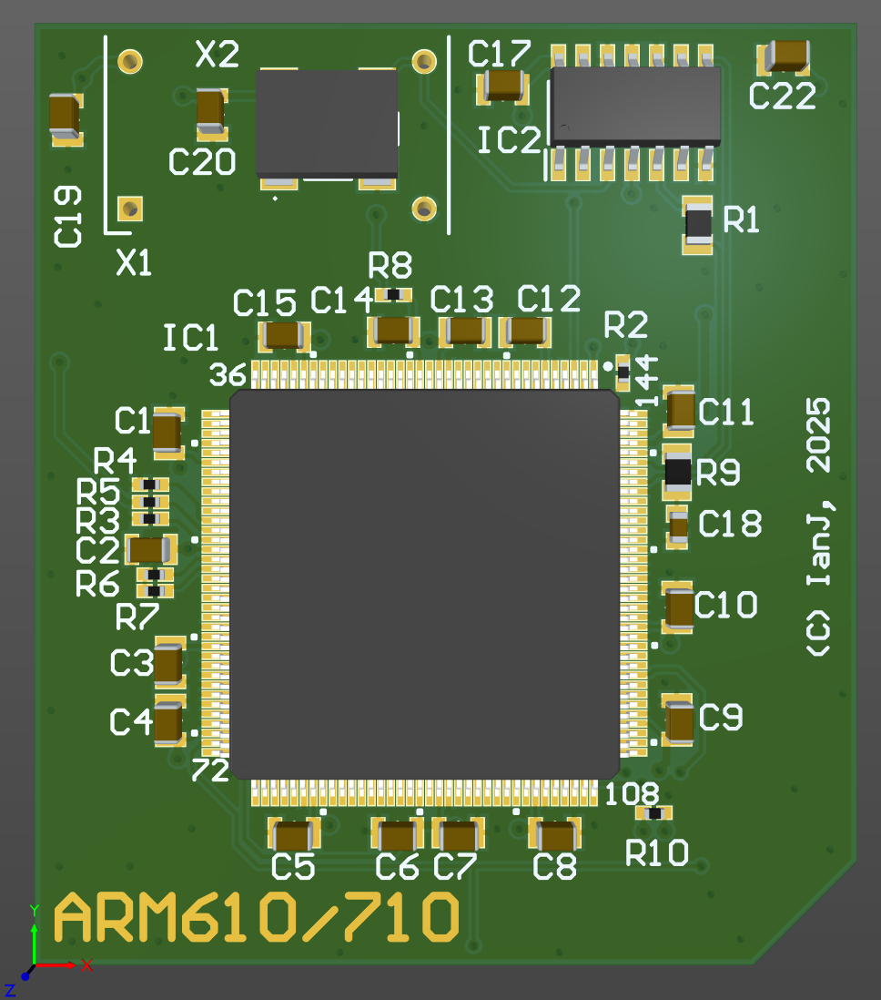

# Acorn Archimedes ARM6 (ARM610/ARM710) processor card

January 2024

An experimental platform adapting an ARM2 PLCC pinout to support an ARM610 or ARM710.

## Licence

No warranty is provided, and this work is used at your own risk.  

Licenced as CC BY-SA 4.0

Copyright 2024 Ian Jeffray

